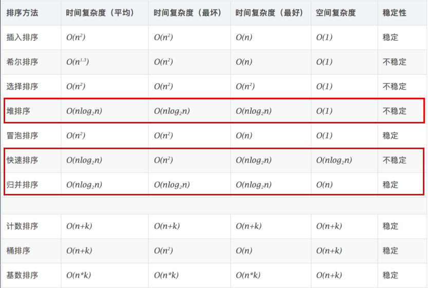

# 算法训练营
## [LeetCode](https://leetcode.com/)

🚀🚀🚀🚀🚀🚀🚀🚀🚀🚀🚀🚀

| 🏷️                    | 📝 💬                                                                                    | ✏️  |
| ---------------------- | ---------------------------------------------------------------------------------------- | --- |
| Array & LinkedList     |                                                                                          |     |
|                        | https://leetcode.com/problems/container-with-most-water/                                 | ✅   |
|                        | https://leetcode.com/problems/climbing-stairs/                                           | ✅   |
|                        | https://leetcode.com/problems/3sum/ (高频老题）                                          | ✅   |
|                        |                                                                                          |     |
|                        | https://leetcode.com/problems/reverse-linked-list/                                       | ✅   |
|                        | https://leetcode.com/problems/swap-nodes-in-pairs                                        | ✅   |
|                        | https://leetcode.com/problems/linked-list-cycle                                          | ✅   |
|                        | https://leetcode.com/problems/linked-list-cycle-ii                                       | ✅   |
|                        | https://leetcode.com/problems/reverse-nodes-in-k-group/                                  | ✅   |
| HomeWork               |                                                                                          |     |
|                        | https://leetcode.com/problems/remove-duplicates-from-sorted-array/                       | ✅   |
|                        | https://leetcode.com/problems/rotate-array/                                              | ✅   |
|                        | https://leetcode.com/problems/merge-two-sorted-lists/                                    | ✅   |
|                        | https://leetcode.com/problems/merge-sorted-array/                                        | ✅   |
|                        | https://leetcode.com/problems/two-sum/                                                   | ✅   |
|                        | https://leetcode.com/problems/move-zeroes/                                               | ✅   |
|                        | https://leetcode.com/problems/plus-one/                                                  | ✅   |
| Stack & Deuque         |                                                                                          |     |
|                        | https://leetcode.com/problems/valid-parentheses/ - 最近相关性 —> 栈！                    | ✅   |
|                        | https://leetcode.com/problems/min-stack/                                                 | ✅   |
|                        | https://leetcode.com/problems/largest-rectangle-in-histogram/                            | ✅   |
|                        | https://leetcode.com/problems/sliding-window-maximum                                     | ✅   |
| HomeWork               |                                                                                          |     |
|                        | https://leetcode.com/problems/design-circular-deque                                      | ✅   |
|                        | https://leetcode.com/problems/trapping-rain-water/                                       | ✅   |
| 哈希表、映射、集合     |                                                                                          |     |
| HomeWork               |                                                                                          |     |
|                        | https://leetcode.com/problems/valid-anagram                                              | ✅   |
|                        | https://leetcode.com/problems/group-anagrams                                             | ✅   |
|                        | https://leetcode.com/problems/two-sum/                                                   | ✅   |
| 树、二叉树、二叉搜索树 |                                                                                          |     |
|                        | https://leetcode.com/problems/binary-tree-inorder-traversal/                             | ✅   |
|                        | https://leetcode.com/problems/binary-tree-preorder-traversal/                            | ✅   |
|                        | https://leetcode.com/problems/n-ary-tree-postorder-traversal/                            | ✅   |
|                        | https://leetcode.com/problems/n-ary-tree-preorder-traversal/                             | ✅   |
|                        | https://leetcode.com/problems/n-ary-tree-level-order-traversal/                          | ✅   |
| 泛型递归、树的递归     |                                                                                          |     |
|                        | https://leetcode.com/problems/climbing-stairs/                                           | ✅   |
|                        | https://leetcode.com/problems/generate-parentheses/                                      | ✅   |
|                        | https://leetcode.com/problems/invert-binary-tree/                                        | ✅   |
|                        | https://leetcode.com/problems/validate-binary-search-tree/                               | ✅   |
|                        | https://leetcode.com/problems/maximum-depth-of-binary-tree/                              | ✅   |
|                        | https://leetcode.com/problems/minimum-depth-of-binary-tree/                              | ✅   |
|                        | https://leetcode.com/problems/serialize-and-deserialize-binary-tree/                     |     |
| HomeWork               |                                                                                          |     |
|                        | https://leetcode.com/problems/lowest-common-ancestor-of-a-binary-tree/                   | ✅   |
|                        | https://leetcode.com/problems/construct-binary-tree-from-preorder-and-inorder-traversal/ | ✅   |
|                        | https://leetcode.com/problems/combinations/                                              | ✅   |
|                        | https://leetcode.com/problems/permutations/                                              | ✅   |
|                        | https://leetcode.com/problems/permutations-ii/                                           | ✅   |
| 分治、回溯             |                                                                                          |     |
|                        | https://leetcode-cn.com/problems/powx-n/                                                 | ✅   |
|                        | https://leetcode-cn.com/problems/subsets/                                                | ✅   |
| Homework               |                                                                                          |     |
|                        | https://leetcode.com/problems/majority-element/ （简单、但是高频）                       | ✅   |
|                        | https://leetcode.com/problems/letter-combinations-of-a-phone-number/                     |     |
|                        | https://leetcode.com/problems/n-queens/                                                  | ✅   |
| DFS & BFS              |                                                                                          |     |
|                        | https://leetcode.com/problems/binary-tree-level-order-traversal                          | ✅   |
|                        | https://leetcode.com/problems/minimum-genetic-mutation                                   | ✅   |
|                        | https://leetcode.com/problems/generate-parentheses                                       | ✅   |
|                        | https://leetcode.com/problems/find-largest-value-in-each-tree-row                        | ✅   |
| HomeWork               |                                                                                          |     |
|                        | https://leetcode.com/problems/word-ladder/                                               | ✅   |
|                        | https://leetcode.com/problems/word-ladder-ii/                                            |     |
|                        | https://leetcode.com/problems/number-of-islands/                                         | ✅   |
|                        | https://leetcode.com/problems/minesweeper/                                               |     |
| 贪心算法               |                                                                                          |     |
|                        | https://leetcode-cn.com/problems/lemonade-change/                                        | ✅   |
|                        | https://leetcode-cn.com/problems/best-time-to-buy-and-sell-stock-ii/                     | ✅   |
|                        | https://leetcode-cn.com/problems/assign-cookies/                                         |     |
|                        | https://leetcode-cn.com/problems/walking-robot-simulation/                               |     |
|                        | https://leetcode-cn.com/problems/jump-game/                                              |     |
|                        | https://leetcode-cn.com/problems/jump-game-ii/                                           |     |
| 二分查找               |                                                                                          |     |
|                        | https://leetcode-cn.com/problems/sqrtx/                                                  | ✅   |
|                        | https://leetcode-cn.com/problems/valid-perfect-square/                                   | ✅   |
| Homework               |                                                                                          |     |
|                        | https://leetcode-cn.com/problems/search-in-rotated-sorted-array/                         | ✅   |
|                        | https://leetcode-cn.com/problems/search-a-2d-matrix/                                     | ✅   |
|                        | https://leetcode-cn.com/problems/find-minimum-in-rotated-sorted-array/                   | ✅   |
| DP                     |                                                                                          |     |
|                        | https://leetcode-cn.com/problems/unique-paths/                                           | ✅   |
|                        | https://leetcode-cn.com/problems/unique-paths-ii/                                        | ✅   |
|                        | https://leetcode-cn.com/problems/longest-common-subsequence/                             | ✅   |
|                        | https://leetcode-cn.com/problems/climbing-stairs/                                        |     |
|                        | https://leetcode-cn.com/problems/triangle/                                               | ✅   |
|                        | https://leetcode-cn.com/problems/maximum-subarray/                                       | ✅   |
|                        | https://leetcode-cn.com/problems/maximum-productsubarray/                                |     |
|                        | https://leetcode-cn.com/problems/coin-change/                                            |     |
|                        |                                                                                          |     |
|                        | https://leetcode-cn.com/problems/house-robber/                                           |     |
|                        | https://leetcode-cn.com/problems/best-time-to-buy-and-sell-stock                         |     |
|                        | https://leetcode-cn.com/problems/best-time-to-buy-and-sell-stock-ii/                     |     |
|                        | https://leetcode-cn.com/problems/best-time-to-buy-and-sell-stock-iii/                    |     |
|                        | https://leetcode-cn.com/problems/best-time-to-buy-and-sell-stock-with-cooldown/          |     |
|                        | https://leetcode-cn.com/problems/best-time-to-buy-and-sell-stock-iv/                     |     |
|                        | https://leetcode-cn.com/problems/best-time-to-buy-and-sell-stock-with-transactionfee/    |     |
|                        | https://leetcode-cn.com/problems/perfect-squares/                                        |     |
|                        | https://leetcode-cn.com/problems/edit-distance/ （重点）                                 |     |
|                        | https://leetcode-cn.com/problems/jump-game/                                              |     |
|                        | https://leetcode-cn.com/problems/jump-game-ii/                                           |     |
|                        | https://leetcode-cn.com/problems/unique-paths/                                           |     |
|                        | https://leetcode-cn.com/problems/unique-paths-ii/                                        |
|                        | https://leetcode-cn.com/problems/unique-paths-iii/                                       |
|                        | https://leetcode-cn.com/problems/coin-change/                                            |     |
|                        | https://leetcode-cn.com/problems/coin-change-2/                                          |     |
| Homework               |                                                                                          |     |
|                        | https://leetcode-cn.com/problems/longest-valid-parentheses/                              | ✅   |
|                        | https://leetcode-cn.com/problems/minimum-path-sum/                                       |     |
|                        | https://leetcode-cn.com/problems/edit-distance/                                          | ✅   |
|                        | https://leetcode-cn.com/problems/decode-ways                                             |     |
|                        | https://leetcode-cn.com/problems/maximal-square/                                         |     |
|                        | https://leetcode-cn.com/problems/max-sum-of-rectangle-no-larger-than-k/                  |     |
|                        | https://leetcode-cn.com/problems/frog-jump/                                              |     |
|                        | https://leetcode-cn.com/problems/split-array-largest-sum                                 |     |
|                        | https://leetcode-cn.com/problems/student-attendance-record-ii/                           |     |
|                        | https://leetcode-cn.com/problems/task-scheduler/                                         |     |
|                        | https://leetcode-cn.com/problems/palindromic-substrings/                                 |     |
|                        | https://leetcode-cn.com/problems/minimum-window-substring/                               |     |
|                        | https://leetcode-cn.com/problems/burst-balloons/                                         |     |
| Trie 树 （Homework）   |                                                                                          |     |
|                        | https://leetcode-cn.com/problems/implement-trie-prefix-tree/                             | ✅   |
|                        | https://leetcode-cn.com/problems/word-search-ii/                                         |     |
| 并查集 （Homework）    |                                                                                          |     |
|                        | https://leetcode-cn.com/problems/friend-circles                                          | ✅   |
|                        | https://leetcode-cn.com/problems/number-of-islands/                                      | ✅   |
|                        | https://leetcode-cn.com/problems/surrounded-regions/                                     |     |
| 高级搜索               |
| 回溯法                 |                                                                                          |     |
|                        | https://leetcode-cn.com/problems/climbing-stairs/                                        |     |
|                        | https://leetcode-cn.com/problems/generate-parentheses/                                   |     |
|                        | https://leetcode-cn.com/problems/n-queens/                                               |     |
|                        | https://leetcode-cn.com/problems/valid-sudoku/description/                               |     |
|                        | https://leetcode-cn.com/problems/sudoku-solver/#/description                             |     |
| 双向 BFS               |                                                                                          |     |
|                        | https://leetcode-cn.com/problems/word-ladder/                                            |     |
|                        | https://leetcode-cn.com/problems/minimum-geneticmutation/                                |     |
| 启发式搜索（A*）       |                                                                                          |     |
|                        | https://leetcode-cn.com/problems/shortest-path-in-binarymatrix/                          |     |
|                        | https://leetcode-cn.com/problems/sliding-puzzle/                                         |     |
|                        | https://leetcode-cn.com/problems/sudoku-solver/                                          |     |
| 高级树、AVL 树和红黑树 |
|                        |                                                                                          |     |
| 位运算                 |                                                                                          |     |
|                        | https://leetcode-cn.com/problems/number-of-1-bits/                                       | ✅   |
|                        | https://leetcode-cn.com/problems/power-of-two/                                           | ✅   |
|                        | https://leetcode-cn.com/problems/reverse-bits/                                           | ✅   |
|                        | https://leetcode-cn.com/problems/n-queens/description/                                   |     |
|                        | https://leetcode-cn.com/problems/n-queens-ii/description/                                |     |
| 布隆过滤器，LRU Cache  |                                                                                          |     |
|                        | https://leetcode-cn.com/problems/lru-cache/                                              | ✅   |
| 排序算法               |                                                                                          |     |
|                        | https://leetcode-cn.com/problems/relative-sort-array/                                    |     |
|                        | https://leetcode-cn.com/problems/valid-anagram/                                          |     |
|                        | https://leetcode-cn.com/problems/design-a-leaderboard/                                   |     |
|                        | https://leetcode-cn.com/problems/merge-intervals/                                        |     |
|                        | https://leetcode-cn.com/problems/reverse-pairs/                                          |     |
| 高级动态规划           |                                                                                          |     |
|                        | https://leetcode-cn.com/problems/longest-increasing-subsequence/                         |     |
|                        | https://leetcode-cn.com/problems/decode-ways/                                            |     |
|                        | https://leetcode-cn.com/problems/longest-valid-parentheses/                              |     |
|                        | https://leetcode-cn.com/problems/maximal-rectangle/                                      |     |
|                        | https://leetcode-cn.com/problems/distinct-subsequences/                                  |     |
|                        | https://leetcode-cn.com/problems/race-car/                                               |     |
| 字符串算法             |                                                                                          |     |
|                        | https://leetcode-cn.com/problems/first-unique-character-in-a-string/                     |     |
|                        | https://leetcode-cn.com/problems/string-to-integer-atoi/                                 |     |
|                        | https://leetcode-cn.com/problems/reverse-string-ii/                                      | ✅   |
|                        | https://leetcode-cn.com/problems/reverse-words-in-a-string                               | ✅   |
|                        | https://leetcode-cn.com/problems/reverse-words-in-a-string-iii/                          |     |
|                        | https://leetcode-cn.com/problems/reverse-only-letters/                                   |     |
|                        | https://leetcode-cn.com/problems/find-all-anagrams-in-a-string/                          |     |
|                        | https://leetcode-cn.com/problems/longest-palindromic-substring                           |     |
|                        | https://leetcode-cn.com/problems/isomorphic-strings/                                     |     |
|                        | https://leetcode-cn.com/problems/valid-palindrome-ii/                                    |     |
|                        | https://leetcode-cn.com/problems/wildcard-matching                                       |     |
|                        | https://leetcode-cn.com/problems/longest-valid-parentheses                               |     |
|                        | https://leetcode-cn.com/problems/distinct-subsequences/                                  |     |
|                        |                                                                                          |     |

> 常见排序总览

## 分享

社群分享：[第三期](share.md)

## Help

- [gitmoji](https://gitmoji.carloscuesta.me/)
- [visualgo]( https://visualgo.net/zh/bst)