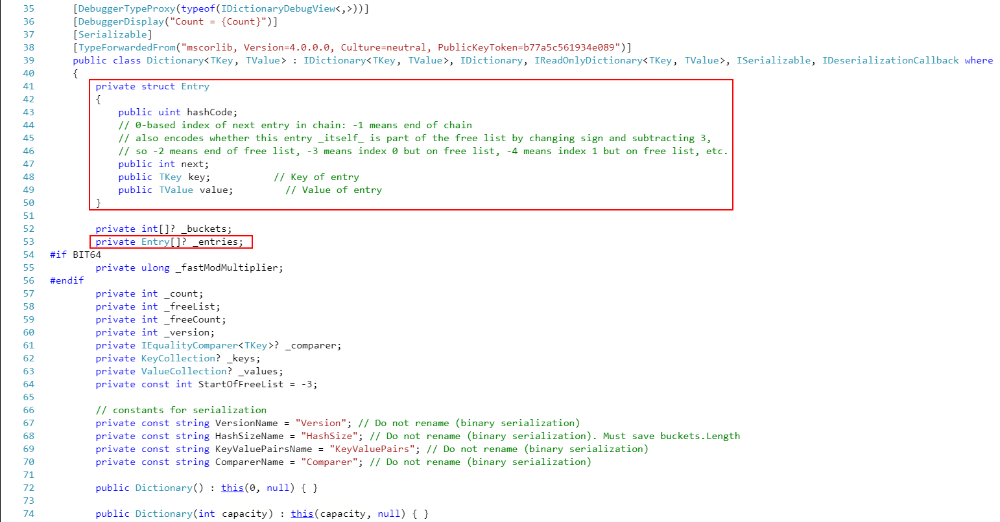
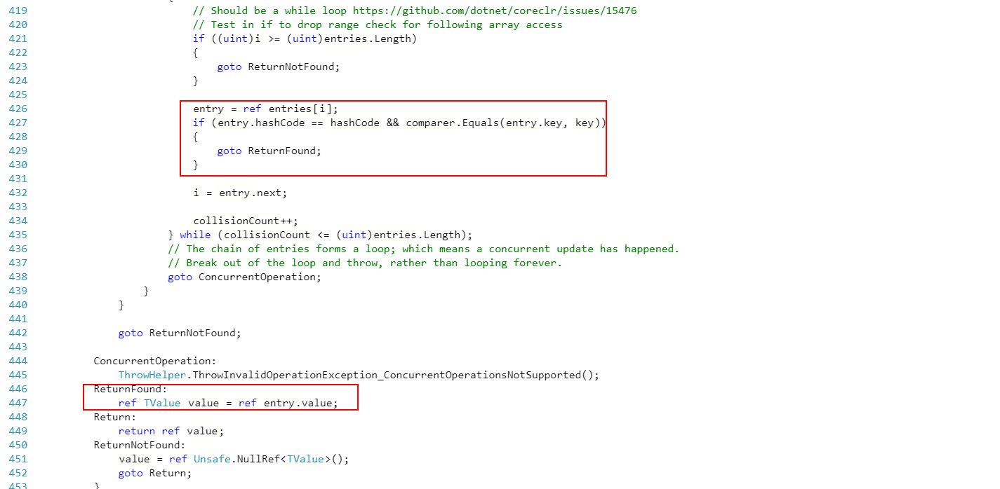
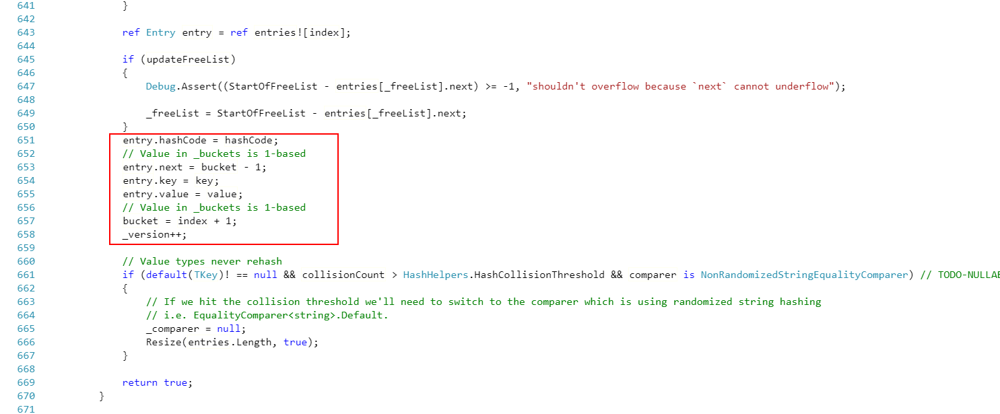
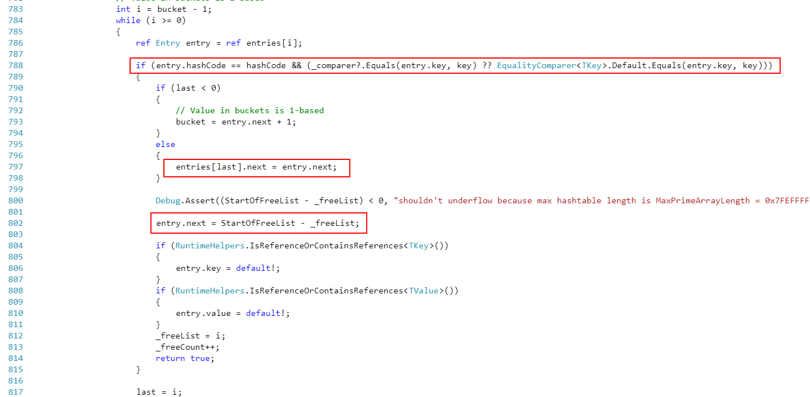
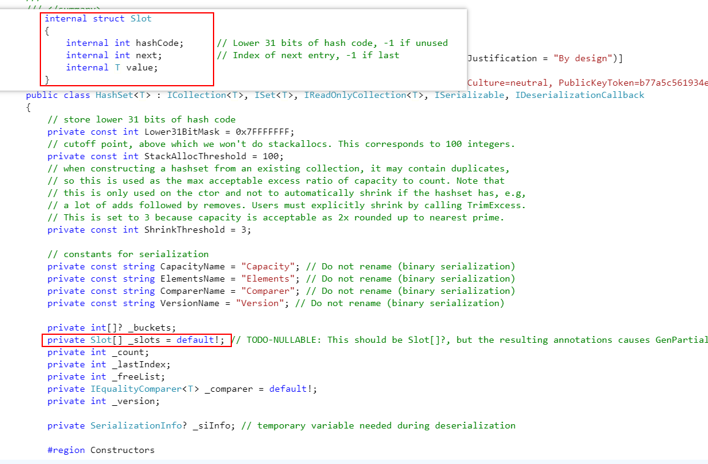
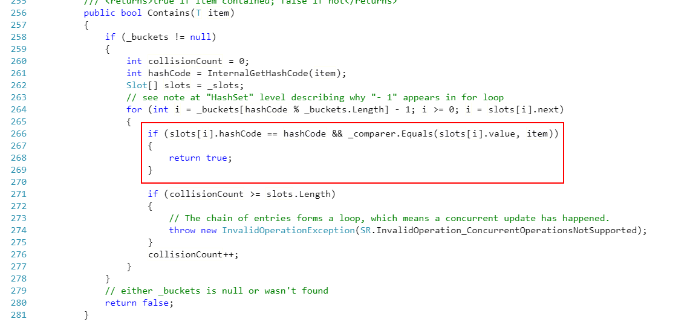
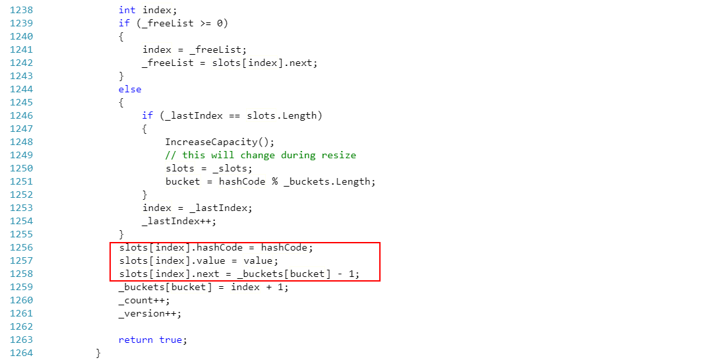
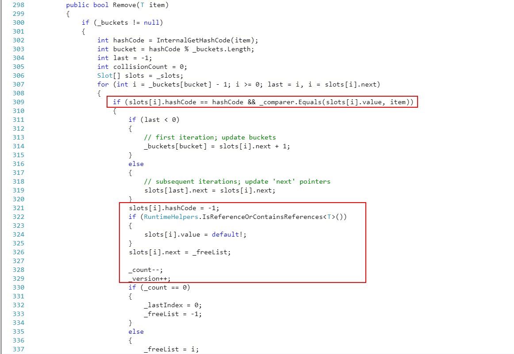

## 主题分享

> 对 Map 和 Set 的一些思考

大家好，我是此次社群分享的分享者周强，接下来我为大家分享的主题是：**对 Map 和 Set 的一些思考**。内容包括如下三部分：

- 分析 Map 和 Set 的数据结构，以及对这两种数据结构的复杂度分析和工程应用
- 浅析 C# 中对应的源码实现：`Dictionary<V,K>`，`HashSet<T>`
- 相关的工程应用：`LRU Cache`

好了，下面开始进入主题。

在训练营第一周的时候，我们接触了 `数组（Array）` 这种数据结构，这种数据结构有着高效的查找（基于索引）特性，时间复杂度为 O(1)。但是这种数据结构有一个天生的缺点，就是只能存储同种类型的数据，而在现实生活以及具体的业务场景中，这种数据结构已经不能满足我们的需求，比如每一本书都会有目录，每个学生都会对应一个班级。试想一下，如果我们用数组来解决这类问题的时候，当我们需要查找某一章节的文章，或者查找某一个班级的学生，由于我们不知道目标的对应位置，无法获取准确索引，所以只能挨个查找，因此平均的时间复杂度为 O(n)，那么对于这种场景，我们还有没有办法进行优化呢？

答案是有的，通过 `升维` 的方式来解决，也就是换一种数据结构 `映射（Map）` 。这种数据结构是键值对（kev-value）类型的，key 具有唯一性，对应的时间复杂度也是 O(n)，虽然用大 O 表示法表示的这两种数据结构时间复杂度是一样的，但是从数量级上来说，映射要远远小于数组的 O(n)，只有在这种数据结构最坏的情况下才会等于数组的 O(n) 数量，这就是典型的以空间换时间。因此，当我们试图通过章节来查找对应的文章，那么我们就可以将章节设置为 Key，对应的所有文章设置为 value，这样一来，我们就可以通过章节以 O(n) 的时间复杂度来找到我们想看的文章；同理，当我们将班级设置为 key，对应的学生设置为 value，那么我们同样可以以 O(n) 的时间复杂度找到那位学生。现在比较流行的 LRU Cache 就是采用这种数据结构，而 Redis 缓存数据库和 Django 开发框架其内部的缓存淘汰机制也都基于该策略。

此外，再介绍一种和数组有关的数据结构 `集合（Set）`，这种数据结构和数组的区别就是内部元素不允许重复，常用于数据去重。

对于上面这两种数据结构都有一个共性：数据唯一性，但是如何做到这一点呢，这里就需要引入一个新的数据处理策略：**Hash**，这个就是用于解决数据碰撞问题常规也是业界普遍都使用的方案。通过设计高效的 Hash 函数可以有效解决数据碰撞，在接下来的源码解析部分，我们就可以看到官方的源码中就有对该策略的使用。

对于 `Map` 和 `Set` 这两种数据结构，不同的编程语言有不同的叫法，我这里以 **C#** 为例来进行部分源码解析。

首先要介绍的是 `Map` 的对应实现 **Dictionary<TKey, TValue>**，其常见的操作如下：

- ContainsKey/ContainsValue
- Keys/Values
- Add/TryAdd
- Remove

<div align='center'>



</div>

从上图展示的部分源码我们可以看出，对于键值对这样的数据结构，官方是内部定义了 `struct` 类型的结构体，然后所有的数据都是存储在该类型的数组中（这里感兴趣的朋友可以思考一下官方为什么不用 `class`，而是 `struct`）。然后上述的常见操作都是基于该数组进行的。这里我截取部分核心代码，如下所示：

<div align='center'>



*ContainsKey 核心代码部分*



*Add/TryAdd 核心代码部分*



*Remove 核心代码部分*

</div>

感兴趣的朋友可以自行查看更多部分源码：[Dictionary<TKey, TValue>](https://source.dot.net/#System.Private.CoreLib/shared/System/Collections/Generic/Dictionary.cs,d3599058f8d79be0)

接着要介绍的是 'Set' 的对应实现 **HashSet<T>**，其常见的操作如下：

- Contains
- Add
- Remove

<div align='center'>



</div>

HashSet<T> 的定义部分和 Dictionary<TKey, TValue> 有异曲同工之妙，也是定义了一个 `Struct` 类型的结构数组。接下来展示相关常见操作的部分核心代码：

<div align='center'>



*Contains 核心代码部分*



*Add 核心代码部分*



*Remove 核心代码部分*

</div>

感兴趣的朋友可以自行查看更多部分源码：[HashSet<T>](https://source.dot.net/#System.Collections/System/Collections/Generic/HashSet.cs,2d265edc718b158b)

最后要分享的部分就是相关的工程应用，现在一些框架内部的缓存淘汰机制很多都是采用 **LRU Cache** 方案，这里包括但不限于 Redis 和 Django。LRU Cache 内部的核心策略是 `最近最少使用原则`，通过这种淘汰机制来实现缓存。LeetCode 上也有对应的题目：[LRU缓存机制](https://leetcode.com/problems/lru-cache/)。这里，我分别用 Python 和 C# 来实现一个简易版的 LRU Cache。

Python 对应的具体实现如下所示：

```python
from collections import OrderedDict

class LRUCache:
    def __init__(self, capacity: int):
        self.dic = OrderedDict()
        self.capacity = capacity
        
    def get(self, key: int) -> int:
        if key not in self.dic:
            return -1
        val = self.dic.pop(key)
        self.dic[key] = val
        return val
        
    def put(self, key: int, value: int) -> None:
        if key in self.dic:
            self.dic.pop(key)
        else:
            if self.capacity > 0:
                self.capacity -= 1
            else:
                self.dic.popitem(last=False)
        self.dic[key] = value
        
# Your LRUCache object will be instantiated and called as such:
# obj = LRUCache(capacity)
# param_1 = obj.get(key)
# obj.put(key,value)
```

C# 对应的具体实现如下所示：

```C#
public class LRUCache
{
    private class Entity
    {
        public int Key { get; set; }
        public int Val { get; set; }
        public Entity(int key, int val)
        {
            Key = key;
            Val = val;
        }
    }

    private readonly int _capacity;
    private int _count;
    private readonly LinkedList<Entity> _items;
    private readonly Dictionary<int, LinkedListNode<Entity>> _keys;

    public LRUCache(int capacity)
    {
        this._capacity = capacity;
        this._count = 0;
        this._items = new LinkedList<Entity>();
        this._keys = new Dictionary<int, LinkedListNode<Entity>>(this._capacity);
    }

    public int Get(int key)
    {
        if (!_keys.ContainsKey(key))
        {
            return -1;
        }

        var cache = _keys[key];
        if (cache != _items.First)
        {
            _items.Remove(cache);
            _items.AddFirst(cache);
        }
        return cache.Value.Val;
    }
    

    public void Put(int key, int value)
    {
        if (!_keys.ContainsKey(key))
        {
            _keys[key] = _items.AddFirst(new Entity(key, value));
            if (_count == _capacity)
            {
                var last = _items.Last;
                _keys.Remove(last.Value.Key);
                _items.RemoveLast();
            }
            else
            {
                _count++;
            }
        }
        else
        {
            var cache = _keys[key];
            cache.Value.Val = value;

            if (cache != _items.First)
            {
                _items.Remove(cache);
                _items.AddFirst(cache);
            }
        }
    }
}

/**
    * Your LRUCache object will be instantiated and called as such:
    * LRUCache obj = new LRUCache(capacity);
    * int param_1 = obj.Get(key);
    * obj.Put(key,value);
    */
```

好了，以上是我此次分享的的全部内容，感谢大家的参与，上述如若有不明白或者错误的地方还请指出，谢谢。